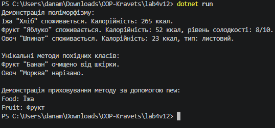

# Лабораторна робота №4

**Тема:** Наслідування. Ключові слова `base`, `override`, `virtual`. Приховування членів (`new`).

**Мета:** Навчитися створювати ієрархії класів, використовувати ключові слова `base`, `virtual`, `override` для реалізації поліморфізму, а також розуміти відмінності між `override` та приховуванням членів за допомогою `new` (варіант 12: `Food`, `Fruit`, `Vegetable`).

## Хід роботи

У ході виконання роботи за допомогою .NET CLI у директорії `OOP-Kravets` створено консольний проєкт `lab4v12`.

У файлі `Program.cs` реалізовано ієрархію класів:

- **Базовий клас `Food`:** приватні поля `_name` і `_calories`, публічні властивості `Name` і `Calories`, конструктор, віртуальний метод `Eat()` та метод `GetFoodType()`.
- **Похідний клас `Fruit`:** поле `_sweetnessLevel`, властивість `SweetnessLevel`, конструктор із викликом `base(...)`, перевизначений метод `Eat()`, власний метод `Peel()`.
- **Похідний клас `Vegetable`:** поле `_isLeafy`, властивість `IsLeafy`, конструктор із викликом `base(...)`, перевизначений метод `Eat()`, власний метод `Chop()`.
- **Демонстрація `new`:** у класі `Fruit` створено метод `new GetFoodType()`, який приховує метод `GetFoodType()` базового класу `Food`.

У точці входу `Main`:

1. Створено об'єкти базового та похідних класів.
2. Продемонстровано поліморфну поведінку `Eat()` через посилання на базовий клас `Food`.
3. Викликано унікальні методи `Peel()` та `Chop()`.
4. Показано різницю між `override` і `new` під час виклику `GetFoodType()` через посилання типів `Food` і `Fruit`.

## Запуск проєкту

Для запуску потрібен .NET SDK 10. З кореня репозиторію виконайте:

```bash
dotnet run --project lab4v12
```

## Результат виконання програми

> **Місце для скриншота:** після запуску програми зробіть знімок консолі та збережіть його як `image.png` у папці `lab4v12`. Вставте його нижче.



## Відповіді на контрольні запитання

1. **Поясніть принцип наслідування в ООП. Наведіть приклад з реального світу.**

   Наслідування дає змогу створити новий клас на основі вже наявного. Похідний клас отримує доступ до відкритих і захищених членів базового класу та може розширити або змінити його поведінку. Наприклад, `Fruit` і `Vegetable` є різновидами `Food`: вони мають назву й калорійність, але додатково описують власні характеристики.

2. **Для чого використовується ключове слово `base`? Наведіть приклади його застосування.**

   `base` використовується для звернення до членів базового класу. У роботі `base(name, calories)` викликає конструктор `Food` із конструкторів `Fruit` та `Vegetable`. Запис `base.Method()` дає змогу викликати реалізацію методу базового класу з перевизначеного методу.

3. **У чому полягає різниця між `virtual` та `override`? Як вони забезпечують поліморфізм?**

   `virtual` позначає метод базового класу, який дозволено перевизначати. `override` задає нову реалізацію цього методу в похідному класі. Тому виклик `Eat()` через посилання типу `Food` виконує реалізацію фактичного типу об'єкта — `Fruit` або `Vegetable`.

4. **Коли варто використовувати модифікатор `new` для приховування члена базового класу, і які наслідки це має?**

   `new` використовують, коли похідному класу потрібно навмисно надати член із таким самим іменем, але без поліморфного перевизначення. Вибір методу залежить від типу посилання: посилання `Food` викликає `Food.GetFoodType()`, а посилання `Fruit` — `Fruit.GetFoodType()`. Через це `new` варто застосовувати свідомо, оскільки поведінка залежить від типу змінної.
